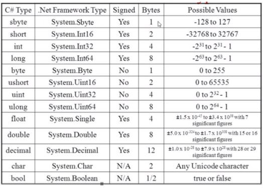

## Fundamentos

01 - Primeiro Programa
02 - Variaveis de Constantes
03 - Tipos
04 - Conversão de tipos
05 - Operadores
06 - Enum

## Estrutura de Controle

01 - IF / else if
02 - While / Do while
03 - For
04 - Switch
05 - Forech
06 - Finally

## Classes e Métodos

01 - Classe vs Objetos
02 - Membros de uma classe
03 - Métodos
04 - Construtor
05 - Atribuição: Valor vs Referência
06 - This
07 - Valores Padrões e NULL
08 - Modificadores de acesso
09 - Interface

## Arrays e Coleções

01 - Array
02 - Matriz
03 - Set / List / Queue / Stack / Map

## Orientação a objetos

01 - Paradigmas
02 - Abstração
03 - Herança
04 - Polimorfismo
05 - Encapsulamento

## Tratatamento de Erros

01 - Tipos de Teste
02 - Teste Unitário

## API

## Documentação
